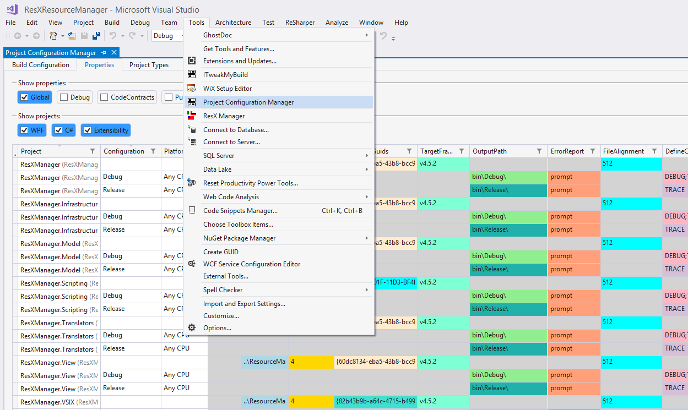
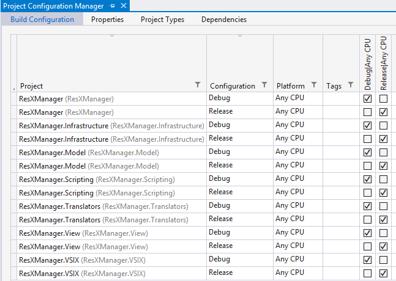
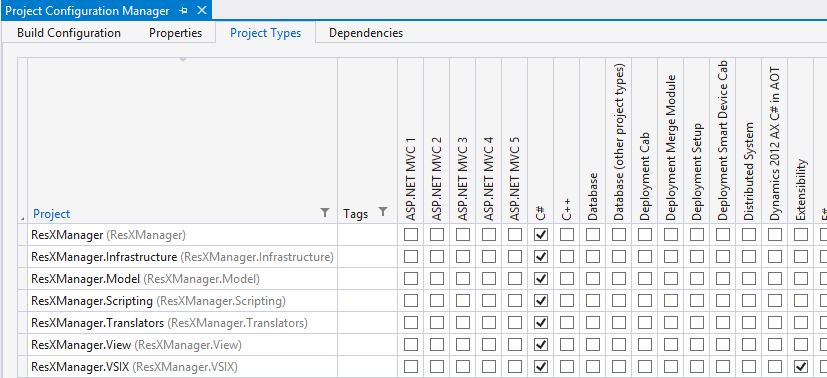
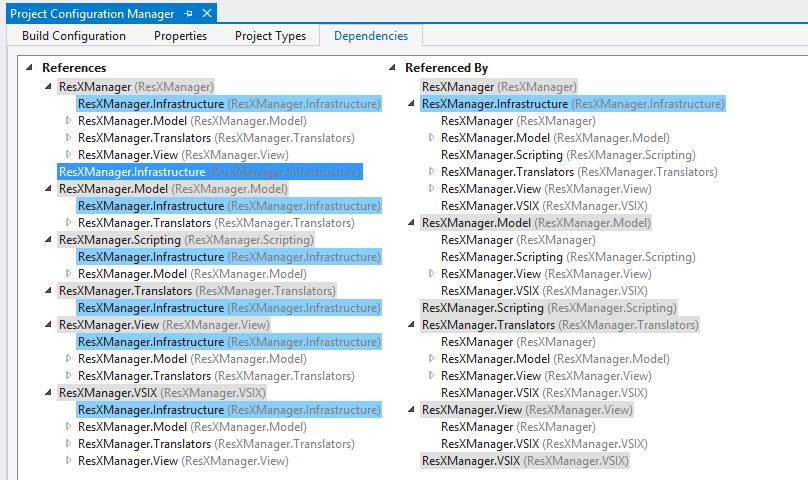
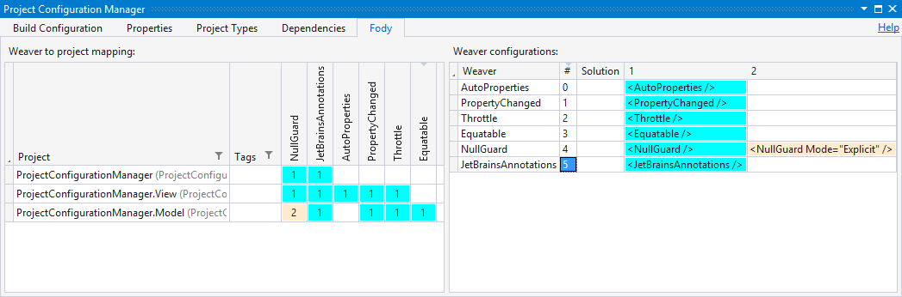

### Project Configuration Manager. 
This Visual Studio extension lets you manage your solution and project configurations in one place. 
Forget about clicking through all the tabs in all the property pages - see all your projects and configurations on one grid. 
Color highlighting let's you verify at a glance if the configurations of your projects are consistent. 
Initialize new projects by simply copy/paste defaults from other projects.

Install the extension from the [Visual Studio Marketplace](https://marketplace.visualstudio.com/items?itemName=TomEnglert.ProjectConfigurationManager).
The latest build is also available at the [Open VsixGallery](http://vsixgallery.com/extension/e31595c9-3e0c-4f5c-b35c-dd8d61e364d1/)

Powered by&nbsp;&nbsp;&nbsp; &nbsp;&nbsp;&nbsp;

Support this Project: 

